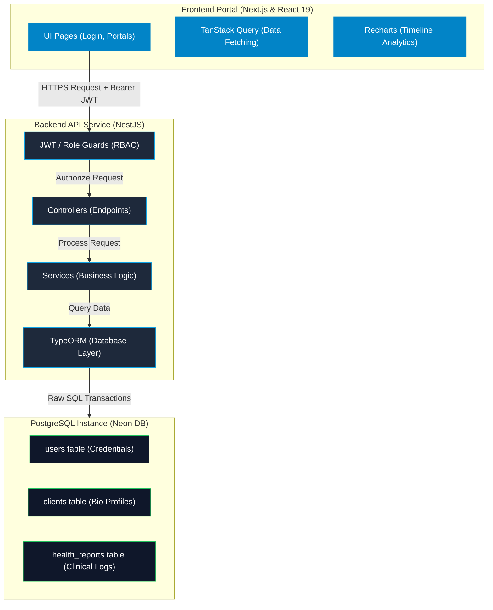
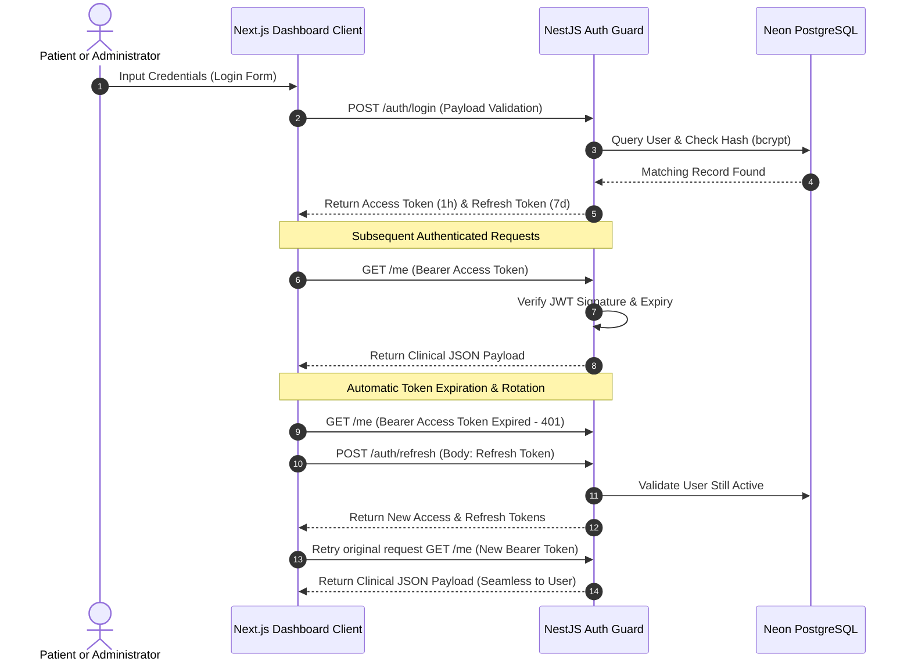

# Technical Decisions - Clinitech Healthcare Dashboard

This document details the architectural choices, schema optimizations, security implementations, and deployment blueprints selected for the Clinitech Healthcare Dashboard.

---

## 1. System Architecture Diagram

### Authentication & Token Rotation Flow

---

## 2. Technology Selection Rationale

### Why NestJS?
- **Enterprise-Grade Structure**: NestJS enforces a unified, modular architecture (Modules, Controllers, Services) which keeps the codebase maintainable as features scale.
- **Out-of-the-Box Security**: Excellent native integrations with security utilities like `@nestjs/passport` for JWT validation, `express-rate-limit` for DDoS prevention, and `helmet` for HTTP headers security.
- **Robust Decorator Ecosystem**: Simplifies Role-Based Access Control (`@Roles(...)`) and validation pipeline handling (`class-validator` / `ValidationPipe`).

### Why TypeORM?
- **Data Integrity**: TypeORM maps TypeScript decorators directly to database schemas, guaranteeing type safety from database query results to service responses.
- **Safe Migrations System**: Features a CLI engine to generate and run SQL schema migrations, keeping production schemas safe (`synchronize: false`).
- **Query Builder Performance**: Provides powerful controls to write batch upserts and perform advanced raw SQL queries (`orIgnore()`, dynamic indexing query bindings) that are essential for loading 30,000 Excel records without performance bottlenecking.

### Why PostgreSQL (Neon)?
- **Relational Integrity**: Supports ACID compliance, foreign keys, and cascading deletes, which are necessary when linking patient bio files to clinical logs.
- **Cloud-Native Scalability**: Neon provides serverless PostgreSQL with instant branching capabilities, automatic storage sizing, and query performance scaling.

---

## 3. Database Design & Optimization

### Indexing Strategy
To optimize query performance across the 30,000 seeded records, indices were placed on columns frequently queried:
1. **`clients.client_id` (Unique PK)**: Ensures instant O(1) patient bio lookups.
2. **`clients.city` & `clients.health_condition`**: Speeds up dynamic dropdown filtering in the Admin portal.
3. **`health_reports.client_id` & `health_reports.report_date`**: Essential for chronologically ordering a specific client's health histories during line chart visualizations.

---

## 4. Role-Based Access Control (RBAC) Strategy

The platform maintains two roles: `ADMIN` and `USER`.
- **Linking Patients to Logins**: The `User` database entity controls credentials. When a patient (`USER`) logs in, they are matched to their patient bio (`Client`) using their unique email address.
- **Enforcement Guards**: Routes are protected at the Controller class or Method level using a custom `@Roles(...)` decorator and a custom `RolesGuard` validating JWT sub role claims.
- **Permission Mapping**:
  - `USER`: Has self-access only (`GET /me`, `/me/latest-report`, `/me/report-history`).
  - `ADMIN`: Has full directory privileges (`GET /admin/clients`, `/admin/clients/:id`, `/admin/reports`) and data ingestion access (`POST /admin/upload-health-report`).

---

## 5. Deployment Choices

- **Frontend (Vercel)**: Offers high-speed content delivery networks, automated Next.js SSR performance optimizations, and serverless routing.
- **Backend (Render)**: Provides a Docker/Node environment for NestJS applications with automated health checks, secure env injection, and automatic deployments from git pushes.
- **Database (Neon)**: Ensures production-grade serverless PostgreSQL instance hosting with connection pooling handles large influxes of concurrent queries.
